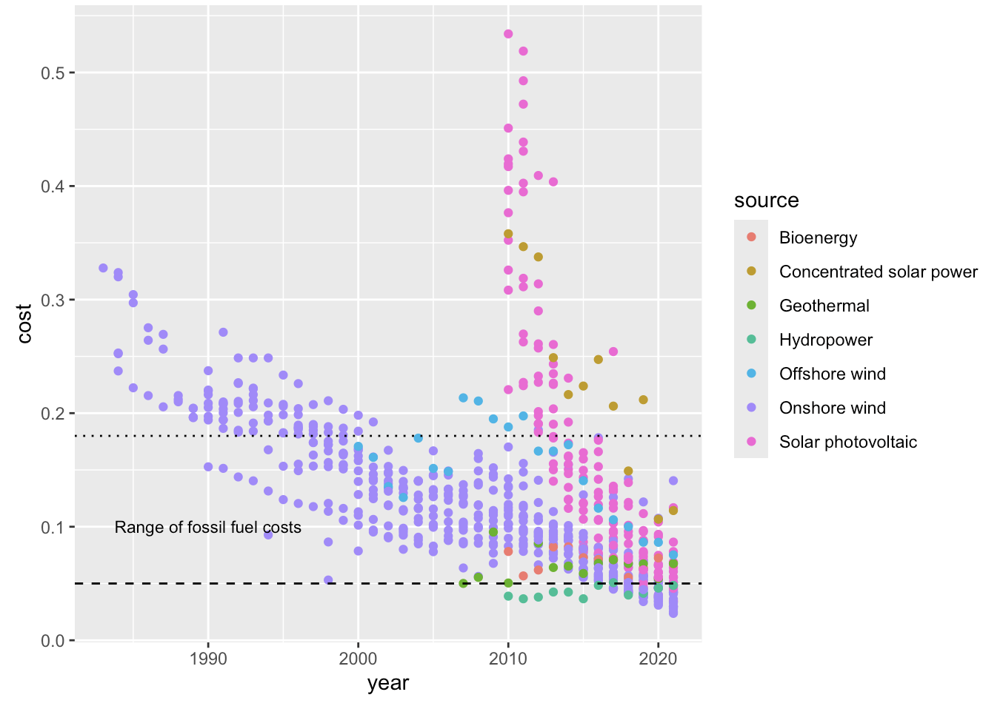

[link to text](https://nolensl0-byte.github.io/energy/)

These plots are comparing the data of GDP per capita, years covered, CO2 emissions, temperature change due to CO2 emissions, energy sources, and the cost of those energy sources. Out of the 4 graphs 3 graphs compare 4 countries. These countries are the United States, Brazil, Japan, and Italy. These comparisons caan allow someone to view the status of the the sustainability goals in tone of the countries shown.

{fig-align="center"}
