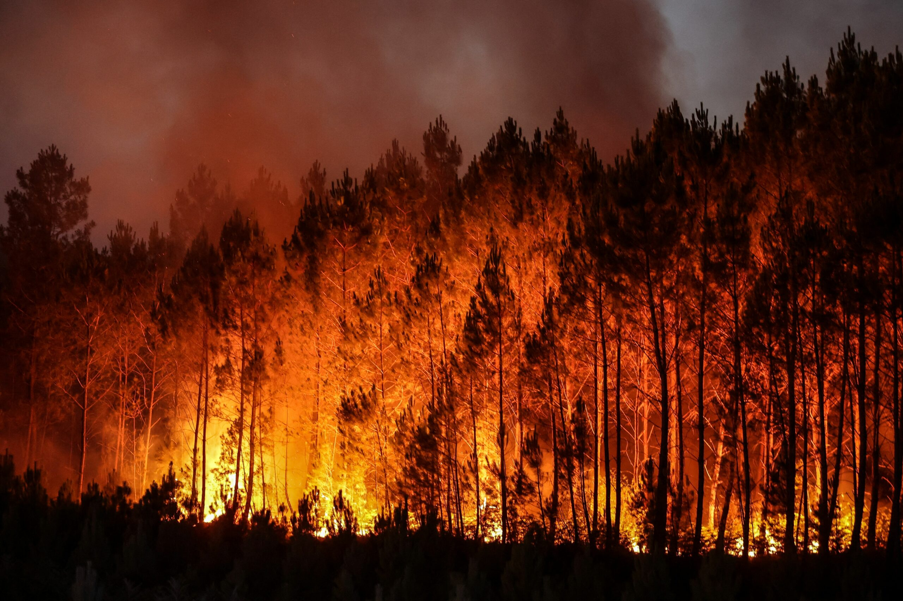

[link to text](https://nolensl0-byte.github.io/wildfire/)

Wildfires are becoming the “new normal”. In all of these countries they are trying different strategies to help prevent wildfires from becoming our “new normal”. With wildfires becoming so common, this increases the CO2 emissions. CO2 emissions are so important when talking about climate change because, this gas is acting as a blanket in the atmosphere and keeping all of the other harmful emissions in the lowest level of the atmosphere that we breath in. With the increase in greenhouse gasses from wildfires this affects our climate and is increasing the temperature and dryness of the Earth. With a hotter and dryer climate this will increase the risk of wildfires everywhere, which will then start over the whole process with releasing even more CO2. So, the more CO2 released warms the Earth which increases the amount of wildfires and then that will cycle back to releasing more CO2 and so on.

{fig-align="center"}
