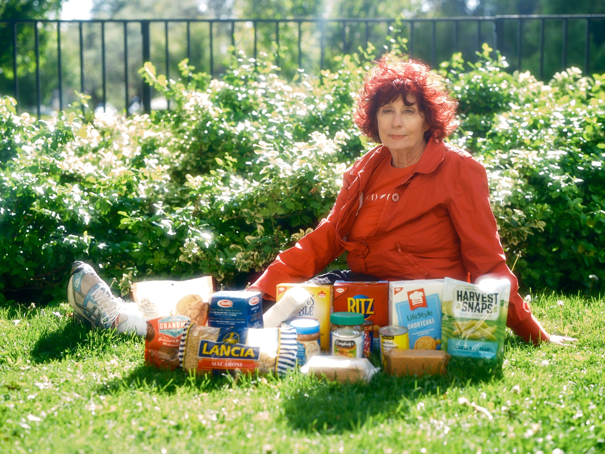

[link to text](https://github.com/nolensl0-byte/data_story_3)

Rising living costs, particularly for groceries, further highlight how poverty affects both developing and wealthier countries. I found an article discussing the conversation between a reporter and older Canadian lady. She goes into detail about the rise in cost when it comes to housing and groceries. This goes to show that even in higher-income countries, more people are experiencing food insecurity as wages fail to keep up with rising prices. This reflects a broader reality: poverty is a global issue shaped by economic systems, inequality, and external shocks. Achieving the “No Poverty” goal will therefore require not only reducing income poverty but also addressing systemic issues like inflation, food access, and economic inequality worldwide.

{fig-align="center"}
