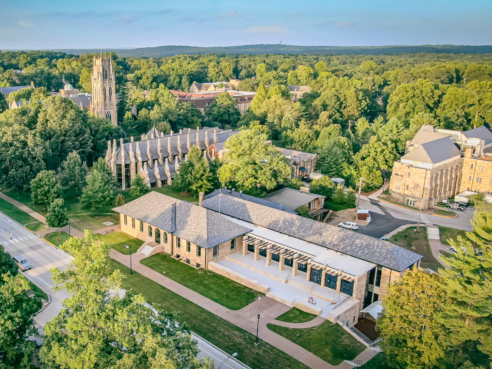

[link to video](https://www.youtube.com/watch?v=mb7vLKrVm5I)

Sewanee is a very environmentally aware place. Everyone here is aware of climate change and how it is going to affect us. This data being explored is from our facilities department. Using this data we can determine if there is a relationship between the rain fall and the temperatures throughout the years and months. Come with me as we dive into this data set and explore Sewanee's data.

{fig-align="center"}
